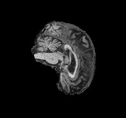
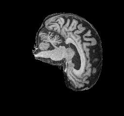

# Implementing a Vision Transformer (ViT) for the [ADNI Dataset](https://adni.loni.usc.edu/)

## Problem Overview
To classify the [ADNI dataset](https://adni.loni.usc.edu/) into two distinct classes, AD or NC (Alzheimer's Disease or Normal Cognitive), using a Vision Transformer to try and achieve a test accuracy of `>0.8`.

This repository contains a deep learning model for classifying Alzheimer's Disease (AD) and Normal Cognition (NC) using MRI scans. This model addresses the critical challenge of early detection and diagnosis of Alzheimer's using the ADNI dataset, which can assist medical professionals by automating the diagnostic process. 

## Dataset Information
The dataset directory is of the following format:
```
AD_NC
├── test
│   ├── AD
│   │   ├── 388206_78.jpeg
│   │   ├── ...│
│   └── NC
│       ├── 1182968_94.jpeg
│       ├── ...│
└── train
    ├── AD
    │   ├── 218391_78.jpeg
    │   ├── ...│
    └── NC
        ├── 808819_88.jpeg
        ├── ...
```
An example of the AD and NC jpeg images are shown below respectively:

 

The dataset undergoes preprocessing before the model is trained on it. Firstly, the training data is labelled according to their true class (`1` for AD, `0` for NC). This implementation is shown below:
```
# Collect filenames for AD (label 1) and NC (label 0) classes
self.ad_files = sorted(os.listdir(os.path.join(self.root_dir, 'AD')))
self.nc_files = sorted(os.listdir(os.path.join(self.root_dir, 'NC')))

# Create a list of (filename, label) tuples for all images
self.images = [(file, 1) for file in self.ad_files] + [(file, 0) for file in self.nc_files]
```
Then, the images are converted to grayscale:
```
# Load image and convert to grayscale
image = Image.open(img_path).convert('L')
```
The training data is then augmented using a series of random transforms:
- Randomly flip image horizontally with 50% chance.
* Randomly rotate image angle within range [-30, +30] degrees.
+ Randomly flip image vertically with 50% chance.

No transformations are applied to the test dataset, although both train and test datasets are applied with the following:
- Resizing to a fixed size of `224x224` pixels.
* Convert PIL image into a PyTorch tensor.
+ Normalize image tensor with `mean = 0.5`, `standard deviation = 0.5`.


Finally, a 80/20 train/validation split was used for the training dataset managed by the following:
```
# Split the training data into training and validation sets
val_size = int(validation_split * len(train_dataset))
train_size = len(train_dataset) - val_size
train_dataset, val_dataset = torch.utils.data.random_split(train_dataset,[train_size, val_size])
```
Within the train.py file, the default dataset directory is within the Rangpur HPC:
>base_data_dir = '/home/groups/comp3710/ADNI/AD_NC'

This can be changed to any directory to the dataset, either locally or remotely.
## ViT Model Architecture
The following figure shows the general model architecture of a Vision Transformer taken from "An Image is Worth 16x16 Words" [1]:
